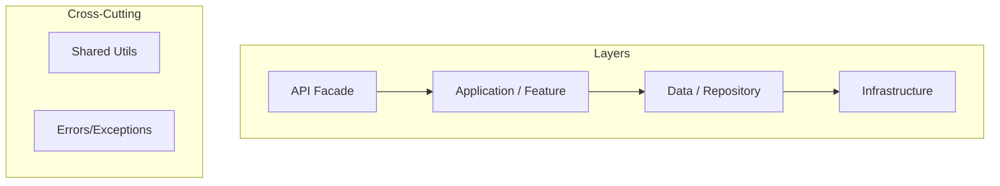

# Architecture

## Goal

This document describes the architectural principles and design patterns used in the `pix_sicoob` package to ensure maintainability, testability, and scalability.

## Core Principles

- **Clean Architecture**: The project is structured into layers (Domain, Infrastructure, Application) to separate concerns and isolate business logic from external dependencies.
- **SOLID Principles**: Each class and module follows SOLID principles to ensure robustness and ease of extension.
- **Test-Driven Design**: A minimum test coverage of 70% is required for all new features.
- **Single Responsibility**: Each layer and class has one, and only one, reason to change.

## Architecture Diagram

## Design Patterns

- **Repository Pattern**: Used for abstracting data access and communication with the Sicoob API.
- **Facade Pattern**: The `PixSicoob` class acts as a simplified interface to the complex subsystems.
- **Dependency Injection**: Dependencies are injected (primarily through constructors) to facilitate mocking and unit testing.
- **Result Pattern**: We use the `result_dart` package to handle success and failure states explicitly, avoiding traditional try-catch blocks for expected logic flow.

## Project Structure

- `lib/src/features`: Contains feature-specific logic. Each feature has its own domain models and repositories.
- `lib/src/services`: Low-level services like HTTP clients and security contexts.
- `lib/src/errors`: Custom exception classes and error handling logic.
- `lib/src/utils`: Shared utility functions.

## External Dependencies

- `http`: Primary HTTP client for API communication.
- `result_dart`: Functional error handling.
- `intl`: Date and currency formatting.
- `mocktail`: Used for mocking dependencies in unit tests.
